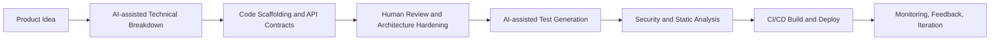

## 1. Introduction: Why AI Developer Tools Matter in Modern SaaS Engineering

AI has moved from experimentation to daily engineering workflow. Over the last few years, we have seen a clear shift: developer tools are no longer limited to static linting, code formatting, and boilerplate scaffolding. They now provide context-aware suggestions, test generation, security insights, and even architecture-level assistance.

For full-stack teams building SaaS products, this changes delivery speed significantly. In practice, AI tools reduce the time spent on repetitive implementation details and free developers to focus on system design, domain logic, and product impact.

In my own work across Spring Boot backends, Next.js frontends, and AI-powered SaaS platforms, the value is clear: AI can accelerate development cycles, but only when used with strong engineering standards and human review.

---

## 2. Categories of AI Developer Tools

### 2.1 Code Generation and Completion

Tools like GitHub Copilot and Amazon CodeWhisperer help generate boilerplate, complete functions, and suggest refactors.

- Fastest gains: DTO mapping, API handlers, typed interfaces, test skeletons.
- Best practice: treat generated code as a draft, not as production-ready output.

### 2.2 Testing and Debugging Assistance

Tools such as DeepCode and Snyk AI highlight code smells, security issues, and risky patterns early.

- Useful for finding null-safety gaps, insecure dependency usage, and missing error handling.
- Complements CI checks by giving near real-time guidance during development.

### 2.3 Documentation and Knowledge Management

AI assistants can transform raw code context into structured docs: API summaries, architecture notes, migration guides, and onboarding checklists.

- Helps keep README and ADR-style documentation up to date.
- Enables faster ramp-up for new developers in multi-repository systems.

### 2.4 Deployment and DevOps Automation

AI-assisted CI/CD workflows can generate Dockerfiles, optimize pipeline steps, and suggest release checks.

- Strong use cases: Docker layer optimization, build caching strategies, and deployment troubleshooting.
- Still requires human validation for reliability and security.

### 2.5 Design and UX Prototyping

AI features in design platforms and Figma plugins can accelerate wireframes, copy variations, and component states.

- Improves designer-developer collaboration in early product phases.
- Useful for quickly validating UX directions before implementation.

---

## 3. Benefits for Developers and Engineering Teams

### 3.1 Speeding Up Repetitive Tasks

AI is especially effective for repetitive coding tasks: CRUD endpoints, validation classes, repetitive UI components, and test scaffolding. This improves cycle time without reducing architecture quality when review is disciplined.

### 3.2 Reducing Bugs and Errors

AI tools can flag potential mistakes before runtime, especially around edge cases and security patterns. They do not replace testing, but they reduce preventable defects early in the workflow.

### 3.3 Improving Code Quality and Maintainability

With proper prompts and constraints, AI can suggest cleaner naming, consistent conventions, and refactoring opportunities. Combined with static analysis and code reviews, this improves long-term maintainability.

### 3.4 Accelerating Learning Curves

When exploring new frameworks, AI assistants act as a just-in-time learning layer. For example, moving between Next.js routing patterns or Spring Boot security configurations becomes faster when you can query practical examples directly in context.

---

## 4. How I Use AI Tools in My Workflow

### 4.1 Backend Development (Spring Boot, Microservices)

I use AI assistants to bootstrap service contracts, DTOs, and integration adapters, then manually harden architecture concerns such as resiliency, tenant isolation, and observability.

```java
@Service
public class InvoiceService {

    private final InvoiceRepository invoiceRepository;
    private final PaymentGatewayClient paymentGatewayClient;

    public InvoiceService(InvoiceRepository invoiceRepository, PaymentGatewayClient paymentGatewayClient) {
        this.invoiceRepository = invoiceRepository;
        this.paymentGatewayClient = paymentGatewayClient;
    }

    public InvoiceResult processInvoice(InvoiceRequest request) {
        // AI can scaffold this flow quickly; production hardening remains a human task.
        validate(request);
        PaymentResponse payment = paymentGatewayClient.charge(request.customerId(), request.amount());
        Invoice invoice = invoiceRepository.save(Invoice.from(request, payment.transactionId()));
        return new InvoiceResult(invoice.getId(), payment.status());
    }

    private void validate(InvoiceRequest request) {
        if (request.amount().signum() <= 0) {
            throw new IllegalArgumentException("Amount must be positive");
        }
    }
}
```

### 4.2 Frontend Development (Next.js, Dynamic Interfaces)

For frontend, AI helps with component scaffolding, typed props, and accessibility-first patterns. I still validate UX behavior, rendering performance, and state boundaries manually.

### 4.3 AI SaaS Development (RAG, Embeddings, Vector Databases)

In AI-focused systems, I use AI tools to speed up integration code around embeddings, retrieval orchestration, and prompt assembly. Core quality still depends on architecture choices: chunking strategy, metadata filtering, and observability.

### 4.4 Example Workflow: Idea to Deployment



This workflow keeps AI in an accelerator role while preserving engineering ownership on design and production decisions.

---

## 5. Limitations and Critical Considerations

### 5.1 Hallucinations and Incorrect Suggestions

AI can generate plausible but incorrect code, including invalid APIs or subtle logic bugs. Every suggestion must be validated with runtime tests and architecture review.

### 5.2 Security and Data Privacy Risks

Never expose secrets, credentials, private customer data, or internal architecture details in prompts unless your governance and tooling explicitly allow it. Prompt hygiene is now part of secure engineering practice.

### 5.3 AI Is Not a Replacement for Engineering Expertise

AI improves speed, not accountability. Developers remain responsible for correctness, scalability, security, and maintainability.

---

## 6. Future of AI for Developers

AI adoption will continue to increase across SaaS and product engineering teams. The next phase is not full replacement of developers; it is deeper integration:

- AI-assisted backlog refinement and technical planning.
- Automated generation of repetitive integration code.
- Better coupling between engineering tools and collaboration platforms.

The strongest teams will combine AI acceleration with rigorous software engineering fundamentals.

---

## 7. Conclusion: AI as a Productivity Multiplier, Used Responsibly

AI tools are becoming essential for modern software delivery. They help developers move faster, reduce repetitive effort, and improve feedback loops across coding, testing, documentation, and deployment.

The key is responsible usage: keep human review at the center, enforce strong security standards, and measure quality outcomes, not just speed. When used this way, AI becomes a force multiplier for building robust full-stack and AI-powered SaaS products.
