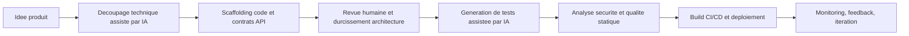

## 1. Introduction : pourquoi les outils IA comptent dans l'ingénierie SaaS moderne

L'IA est passée de l'expérimentation au quotidien des équipes techniques. Ces dernières années, une évolution nette s'est imposée : les outils développeur ne se limitent plus au linting, au formatage ou au scaffolding basique. Ils proposent désormais des suggestions contextualisées, de la génération de tests, des signaux de sécurité, et parfois une aide sur les choix techniques.

Pour les équipes full-stack qui construisent des produits SaaS, l'impact sur la vélocité est concret. En pratique, les outils IA réduisent le temps passé sur les tâches répétitives et permettent de concentrer l'effort sur l'architecture, la logique métier et la valeur produit.

Dans mon propre workflow, entre backends Spring Boot, frontends Next.js et plateformes SaaS augmentées par l'IA, le constat est clair : l'IA accélère fortement la livraison, à condition de conserver des standards d'ingénierie élevés et une revue humaine stricte.

---

## 2. Catégories d'outils IA pour développeurs

### 2.1 Génération et complétion de code

Des outils comme GitHub Copilot ou Amazon CodeWhisperer aident à générer du boilerplate, compléter des fonctions et suggérer des refactors.

- Gains rapides : mapping DTO, handlers API, interfaces typées, squelettes de tests.
- Bonne pratique : traiter le code généré comme un premier jet, pas comme une version production.

### 2.2 Assistance aux tests et au débogage

Des outils comme DeepCode ou Snyk AI détectent tôt les mauvaises pratiques, vulnérabilités potentielles et patterns risqués.

- Utiles pour repérer des failles de null-safety, des usages dépendances non sûrs et des oublis de gestion d'erreurs.
- Complètent les contrôles CI en apportant un retour quasi immédiat pendant le développement.

### 2.3 Documentation et gestion de la connaissance

Les assistants IA peuvent transformer le contexte code en documentation structurée : résumés d'API, notes d'architecture, guides de migration, checklists d'onboarding.

- Facilite la mise à jour de README et de documents de décision technique.
- Accélère la montée en compétence dans des systèmes multi-repositories.

### 2.4 Déploiement et automatisation DevOps

Les workflows CI/CD assistés par IA peuvent générer des Dockerfiles, optimiser des étapes de pipeline et suggérer des contrôles de release.

- Cas utiles : optimisation des couches Docker, stratégies de cache build, investigation d'échecs de déploiement.
- Validation humaine indispensable pour la fiabilité et la sécurité.

### 2.5 Design et prototypage UX

Les fonctions IA dans les outils design et plugins Figma accélèrent wireframes, variantes de copy et états de composants.

- Renforce la collaboration design-dev en phase amont.
- Permet de valider rapidement des directions UX avant implémentation.

---

## 3. Bénéfices pour les développeurs et les équipes

### 3.1 Accélérer les tâches répétitives

L'IA est particulièrement efficace sur les tâches répétitives : endpoints CRUD, classes de validation, composants UI redondants, scaffolding de tests. Le cycle de delivery s'améliore sans sacrifier la qualité, si la revue reste rigoureuse.

### 3.2 Réduire bugs et erreurs

Les outils IA peuvent signaler des erreurs potentielles avant exécution, notamment sur les cas limites et certains patterns de sécurité. Ils ne remplacent pas les tests, mais réduisent les défauts évitables plus tôt.

### 3.3 Améliorer qualité et maintenabilité

Avec des prompts précis et des contraintes claires, l'IA peut proposer un nommage plus cohérent, des conventions homogènes et des opportunités de refactor. Combiné à l'analyse statique et aux code reviews, cela améliore la maintenabilité.

### 3.4 Apprendre plus vite de nouveaux frameworks

Lorsqu'on explore de nouvelles stacks, l'IA agit comme une couche d'apprentissage à la demande. Passer d'un pattern de routing Next.js à une configuration Spring Boot Security devient plus rapide avec des exemples contextualisés.

---

## 4. Comment j'utilise les outils IA dans mon workflow

### 4.1 Développement backend (Spring Boot, microservices)

J'utilise l'IA pour initialiser des contrats de services, DTOs et adaptateurs d'intégration, puis je renforce manuellement les dimensions critiques : résilience, isolation multi-tenant et observabilité.

```java
@Service
public class InvoiceService {

    private final InvoiceRepository invoiceRepository;
    private final PaymentGatewayClient paymentGatewayClient;

    public InvoiceService(InvoiceRepository invoiceRepository, PaymentGatewayClient paymentGatewayClient) {
        this.invoiceRepository = invoiceRepository;
        this.paymentGatewayClient = paymentGatewayClient;
    }

    public InvoiceResult processInvoice(InvoiceRequest request) {
        // L'IA peut accélérer ce squelette, mais le durcissement production reste humain.
        validate(request);
        PaymentResponse payment = paymentGatewayClient.charge(request.customerId(), request.amount());
        Invoice invoice = invoiceRepository.save(Invoice.from(request, payment.transactionId()));
        return new InvoiceResult(invoice.getId(), payment.status());
    }

    private void validate(InvoiceRequest request) {
        if (request.amount().signum() <= 0) {
            throw new IllegalArgumentException("Amount must be positive");
        }
    }
}
```

### 4.2 Développement frontend (Next.js, interfaces dynamiques)

Côté frontend, l'IA m'aide sur le scaffolding de composants, le typage des props et certains patterns orientés accessibilité. Je valide ensuite manuellement les comportements UX, la performance de rendu et les frontières d'état.

### 4.3 Développement SaaS IA (RAG, embeddings, base vectorielle)

Dans les systèmes IA, j'utilise ces outils pour accélérer le code d'intégration autour des embeddings, de l'orchestration retrieval et de l'assemblage de prompt. La qualité finale dépend surtout des choix d'architecture : chunking, filtres metadata et observabilité.

### 4.4 Exemple de workflow : de l'idée au déploiement



Ce workflow garde l'IA dans un role d'accelerateur tout en preservant la responsabilite technique sur les decisions de conception et de production.

---

## 5. Limites et points de vigilance

### 5.1 Hallucinations et suggestions incorrectes

L'IA peut produire du code plausible mais faux : API inexistantes, logique fragile, erreurs subtiles. Chaque suggestion doit etre validee par des tests et une revue technique.

### 5.2 Risques securite et confidentialite

Ne jamais exposer secrets, credentials, donnees clients sensibles ou details d'architecture interne dans les prompts, sauf cadre de gouvernance explicite. L'hygiene de prompt fait partie de l'ingenierie securisee.

### 5.3 L'IA ne remplace pas l'expertise humaine

L'IA augmente la vitesse, pas la responsabilite. Les developpeurs restent garants de la correction, de la scalabilite, de la securite et de la maintenabilite.

---

## 6. Le futur de l'IA pour les developpeurs

L'adoption de l'IA va continuer de croitre dans les equipes SaaS et produit. La prochaine phase n'est pas le remplacement total des developpeurs, mais une integration plus profonde :

- Assistance IA sur le cadrage backlog et la planification technique.
- Generation automatique des integrations repetitives.
- Couplage plus fort entre outils d'ingenierie et outils collaboratifs.

Les equipes les plus performantes combineront acceleration IA et fondamentaux solides d'ingenierie logicielle.

---

## 7. Conclusion : l'IA comme multiplicateur de productivite, avec responsabilite

Les outils IA deviennent un levier central dans la livraison logicielle moderne. Ils aident a aller plus vite, a reduire les efforts repetitifs et a ameliorer les boucles de feedback en code, tests, documentation et deploiement.

La cle reste l'usage responsable : revue humaine systematique, standards securite stricts et pilotage par la qualite, pas uniquement par la vitesse. Utilisee ainsi, l'IA est un multiplicateur puissant pour construire des produits full-stack et SaaS IA robustes.
